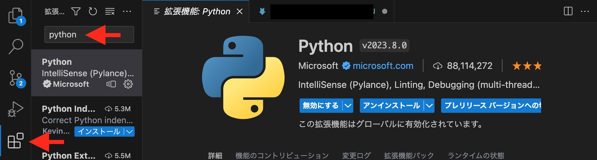
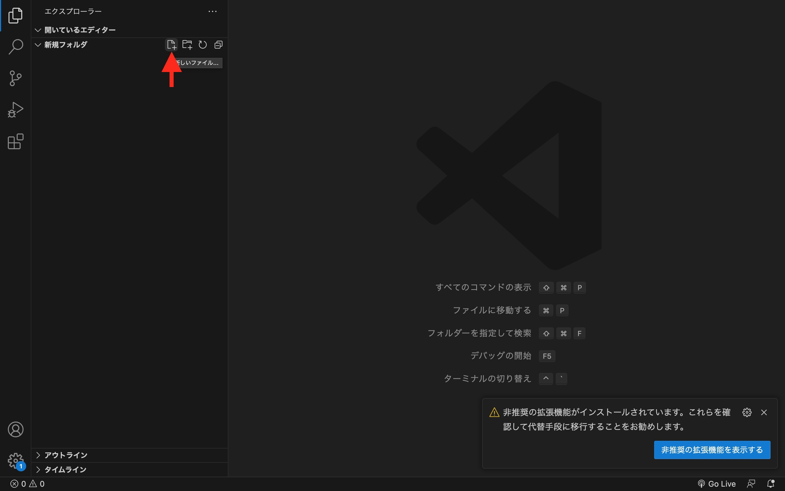
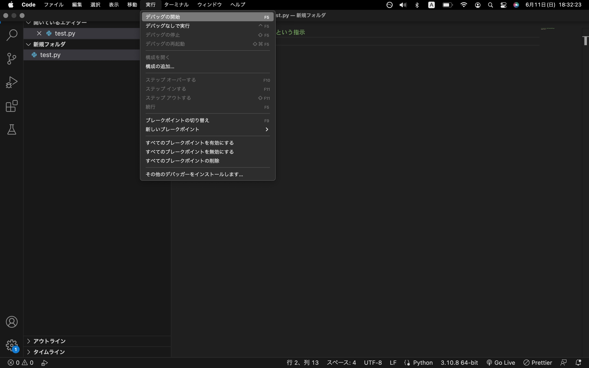
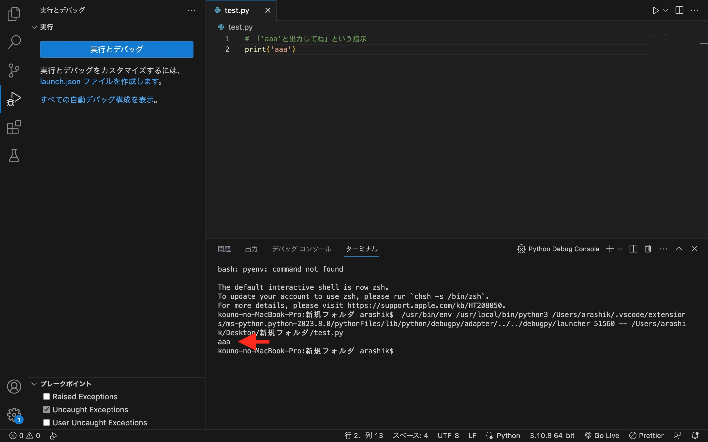

# 初めてのプログラミング
## 1.開発環境を用意する
* 1-1.エディタ
    * VSCode
        * https://code.visualstudio.com/    
            * 拡張機能"Japanese Language Pack"と"Python"を入れておきましょう
                * https://www.javadrive.jp/vscode/install/index4.html#section1
                
* 1-2.プログラミング言語
    * Python
        * https://www.python.org/downloads/
        インストール完了したら、コマンドプロンプトorターミナルで以下を実行
        `Python -V`(Windows)
        `Python3 -V`(Windows)

## 2.プログラムを書いてみよう
* 2-1.ファイル作成
    * 新規フォルダを作成し、VSCodeで開く(1-2で作成つくったフォルダそのままでもOK)
    * 新規ファイルを作成し、名前を`[好きな名前].py`にする。
    
* 2-2.ファイル内にコードを書いてみる

        ```python:step1
        # 「'aaa'と出力してね」という指示
        print('aaa')
        ```

## 3.プログラムを実行する
* 3-1. `ctrl + S`or`cmd + S`でファイルを保存する
* 3-2 画面上部の"実行"から、"デバッグの開始"をクリック。デバッグ構成は"Python"を選ぶ。
    
    * `aaa`という実行結果が出力されたら成功！
    

* 3-3いろんなプログラムを実行してみよう
    ```python:step2.py
    # 1+1の計算結果を出力
    print(1+1)
    ```

    ```python:step3.py
    # 入力した値の倍の数値を出力
    raw=int(input('数値を入力してください'))
    # ターミナルに'数値を入力してください'と表示されたら好きな数値を入力してEnter
    result=raw*2
    print(result)
    ```

    ```python:step4.py
    # 後出しじゃんけん君
    def janken(player_hand):
        if player_hand =='グー':
            return('パー')
        elif player_hand =='パー':
            return('チョキ')
        elif player_hand =='チョキ':
            return('グー')
        else:
            return('error')
    print('私とじゃんけんしましょう')
    player_hand = input('グーかチョキかパーを選んでください')
    return_hand = janken(player_hand)
    if return_hand == 'error':
        print('あなたの反則により私の勝ちです。')
    else:
        print('私は'+return_hand+'を出しました。私の勝ちです。')
    ```