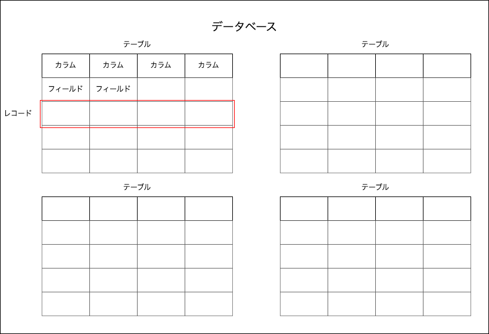
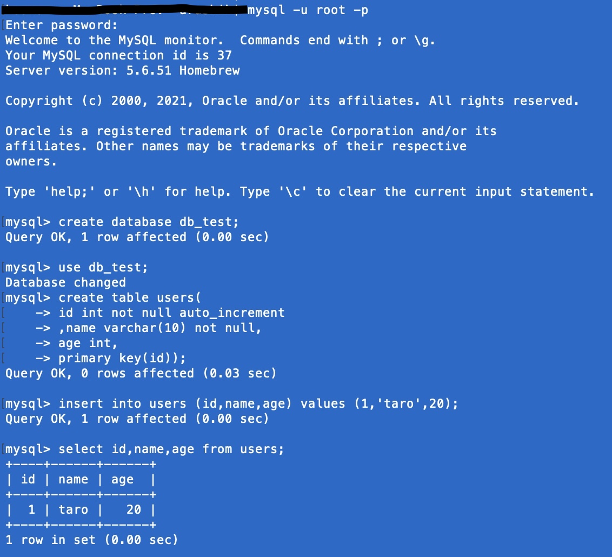

# リレーショナル・データベース
## 1.リレーショナル・データベースとは？
* 1-1.そもそもデータベースとは？
    * さまざまなデータの集合体のこと
    * データベース管理システム(DBMS)で管理される
    * 身近なシステムで使われている
        * ゲームの場合…
            →キャラクターの情報、アイテムの情報、モンスターの情報などをデータベースで管理
        * ECサイトの場合…
            →顧客の情報、商品の情報、取引の履歴などをデータベースで管理
        * ブログの場合…
            →記事、コメント、読者情報などをデータベースで管理

* 1-2.リレーショナル・データベースとは？
    * データベースを管理方法で分類したうちの一つ
    * エクセルのようなイメージ。列と行から構成される表形式でデータを整理するのがポイント
    * 現在は、データベースといえばリレーショナルデータベースを指すケースが多い
    * 参考：https://it-trend.jp/database/article/89-0066

## 2.データベース管理システム
* 2-1.データベースを操作する仕組み
    * データベースは、データベース管理システム（DBMS）を介して、SQLという言語で操作する
    
* 2-2.DBMS(mysql)をインストールする
    * Windows
    https://it-kyujin.jp/article/detail/1606/
    * Mac
    https://prog-8.com/docs/mysql-env

## 3.mysqlでリレーショナル・データベースを操作する
* 3-1.リレーショナルデータベースの仕組み
    * a.構造
        * 一つのデータベースの中には複数のテーブル(=表)が存在
        * テーブルには固定のカラム(=列)が存在
        * データ一行のことをレコードと呼び、ひとマスのことをフィールドと呼ぶ
        
    * b.カラム
        * リレーショナル・データベースでは、カラムごとに決まった種別の値を管理する
        * 顧客情報を管理するテーブルでは、カラムは
        `ID,名前,メールアドレス,住所,年齢,,,`
        のような感じ
        * カラムには制約をつけることができる。たとえば、
            > * IDの重複は許容しない(UNIQUE 制約)
            > * 名前は必須項目(not null)
            > * 年齢には数字しか入らないようにする(データ型の指定)
* 3-2.mysqlを立ち上げる
    * コマンドプロンプト（ターミナル）で、
    `mysql -u root -p`
    を実行し、パスワードを入力後Enter
    * コマンドの入力欄が`mysql>`となったら立ち上げ成功
* 3-3.SQLで操作する
    * データベースの作成
        * `create database [データベース名];`
    * データベースの中に入る
        * `use [データベース名];`
    * テーブルを作成
        * `create table [テーブル名] ([カラム名] [型] [制約],[カラム名] [型] [制約],,,);`
        * 例：
        `CREATE TABLE users (id int NOT NULL AUTO_INCREMENT,name varchar(20) NOT NULL,age int,PRIMARY KEY (id)) ;`
    * テーブルにレコードを挿入
        * `insert into [テーブル名] ([カラム名],[カラム名],[カラム名]) values ([データ],[データ],[データ])；`
        * 例：
         `insert into users (id,name,age) values (1,'taro',20);`
            * ※値が文字列の時は`'`(シングルクォーテーション)で囲う
    * テーブルの中身を取得
        * `select [カラム名],[カラム名],[カラム名] from [テーブル名];`
            * 全てのカラムを取得する時は
            ` select * from [テーブル名]
        * 例：
        `select id,name,age from users;`
    