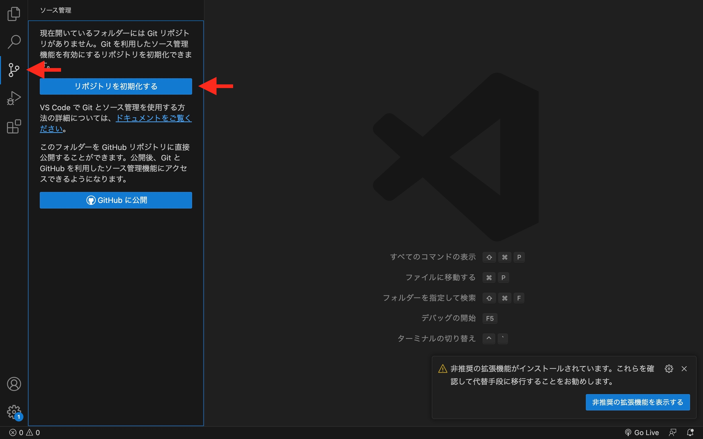
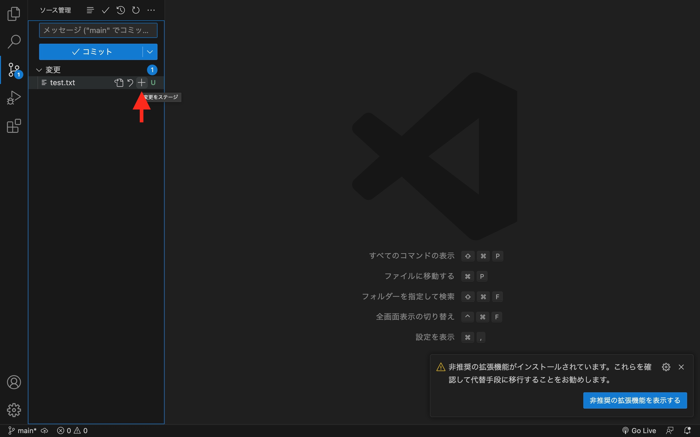
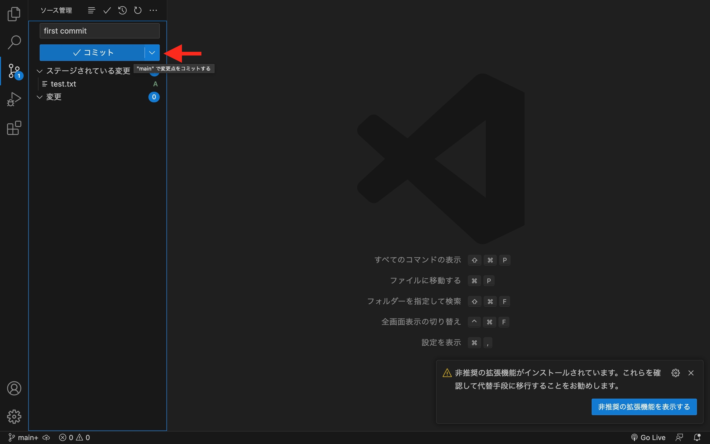
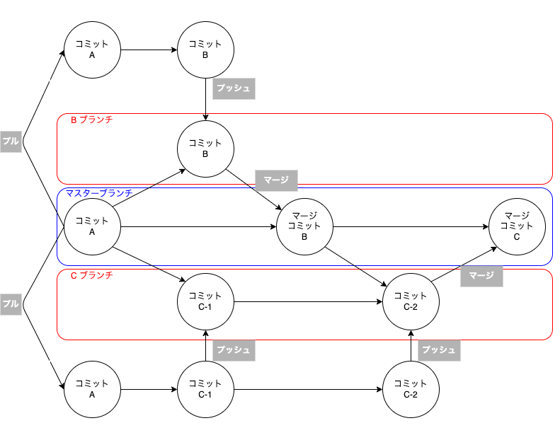
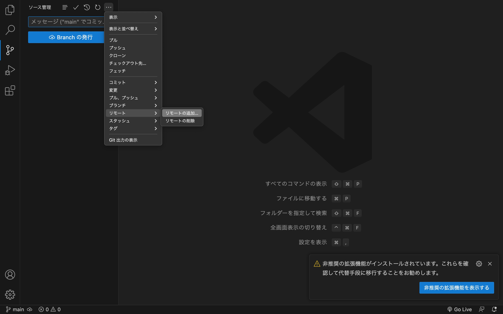

# バージョン管理と共同編集
## 1.gitの導入
* 1-1.gitとは
    * 変更履歴の管理ツール
    * 成果物に対する変更履歴を預けておく、銀行のようなもの    
        * 例えば、、、
            * 1月1日、新しいシステムを作る
            →`A_1.0`とする
            * 1月2日、A_1.0にxという機能を追加
            →`A_1.1`とする
            * 1月3日、A_1.1にyという機能を追加
            →`A_1.2`とする
            * 1月4日、x機能にバグを発見
            →「y機能は残したいが、x機能だけを取り除きたい」
        * GoogleDriveで管理すると、、、
            * →「A_1.0とA_1.2をダウンロードして、A_1.2からy機能の部分だけA_1.0にコピペして、コピペミスや漏れをチェックして、、、」
        * gitで管理すると、、、
            * →「1月2日の変更履歴だけキャンセル！」ができる。(y機能は残る)
* 1-2.git for windowsの導入
    * https://www.curict.com/item/60/60bfe0e.html
        * ↑項目は多いですが、指示通りに操作するだけなのでシンプルです

* 1-3.git for macの導入
    * ターミナルで下記を順番に実行
        * `
    /bin/bash -c "$(curl -fsSL https://raw.githubusercontent.com/Homebrew/install/HEAD/install.sh)"
    `
        * `
    brew install git
    `
## 2.gitを使ってみる
* 2-1.用語解説
    * リポジトリ
        * ファイルと変更履歴の保管場所のこと
        * もっと詳しく知りたい方は↓
            * https://wa3.i-3-i.info/word15664.html
    * コミット
        * 変更をリポジトリに預ける動作のこと
        * もっと詳しく知りたい方は↓
            * https://wa3.i-3-i.info/word141.html
    * ステージング
        * コミットの対象にする変更を選んでスタンバイさせること
* 2-2.一通りの流れを体験してみよう
    * a.リポジトリを作る
        * 新規フォルダを作成し、VSCodeで開く
        * ソース管理タブを開き、"リポジトリを初期化する"をクリック
        
        * 新規フォルダがリポジトリになりました！
        * ※フォルダ名に日本語が含まれるとエラーが起きることがあります。
    * b.初めてのコミットをする
        * フォルダ内にファイルを作成→`test.txt`
        * ファイル内にaaaと記載して保存
        * ソース管理タブを開き、`test.txt`の隣の+ボタンを押す(ステージング)
        
        * テキストボックスに`first commit`と入力し、コミットボタンを押す
        
        * コミット完了！
        * ※テキストボックスには、リポジトリにどんな変更を加えたかわかるような言葉を入力しましょう
## 3.githubを使ってみる
* 3-1.githubとは
    * リポジトリを複数人で共有し、共同編集することができるオンラインサービス
* 3-2.用語解説
    * ローカルリポジトリ
        * 作業者のコンピューター上のリポジトリのこと
    * リモートリポジトリ
        * github上で共有しているリポジトリのこと
    * プッシュ
        * ローカルリポジトリへコミットした内容を、リモートリポジトリに同期すること
        * 複数のコミットをまとめてプッシュすることもできる
    * プル
        * リモートリポジトリへのコミットを、ローカルリポジトリに同期すること
        * 複数のコミットをまとめてプルすることもできる
    * ブランチ
        * リポジトリ上で変更履歴のツリーを枝分かれさせることができる
        * ブランチとはその枝一本一本のこと
        * 複数機能を同時開発する際に使う
    * マージ
        * ブランチへのコミットをマスターブランチ(木の幹にあたる)に取り込むこと

* 3-3.githubを使ってみよう
    * a.サインアップ
        * https://github.com/
    * b.VScodeと連携
        * 新規フォルダを作成してローカルリポジトリにする
        * "リモートを追加"を選択
        
        * テキストボックスに下記URLを打ち込んで候補の一番上を選択
        `https://github.com/Arashi-Shisy/sdcd_git_test`
        * リモート名に`git_test`と入力してEnter
        * 接続完了！
    * c.ローカルリポジトリにプル
        * "指定元からプル"を選択
        * 一番上の候補を選択
    * d.自分の変更をリモートリポジトリにプッシュ
        * test.txtの中身を書き換えてコミット(あとでわかるコミットメッセージをつける)
        * "プッシュ先"を選択
        * 一番上の候補を選択
    * e.反映を確認してみよう
        * https://github.com/Arashi-Shisy/sdcd_git_test
        にアクセス
        * test.txtの横に、自分のコミットメッセージが表示されていれば成功！